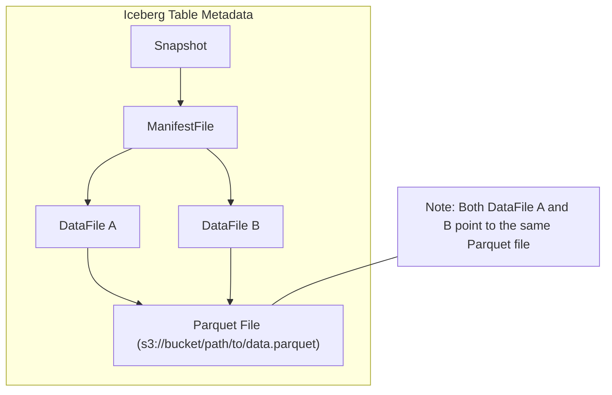
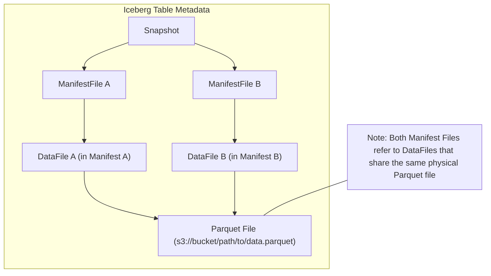

---
hide:
  - navigation
---

<!--
  - Licensed to the Apache Software Foundation (ASF) under one
  - or more contributor license agreements.  See the NOTICE file
  - distributed with this work for additional information
  - regarding copyright ownership.  The ASF licenses this file
  - to you under the Apache License, Version 2.0 (the
  - "License"); you may not use this file except in compliance
  - with the License.  You may obtain a copy of the License at
  -
  -   http://www.apache.org/licenses/LICENSE-2.0
  -
  - Unless required by applicable law or agreed to in writing,
  - software distributed under the License is distributed on an
  - "AS IS" BASIS, WITHOUT WARRANTIES OR CONDITIONS OF ANY
  - KIND, either express or implied.  See the License for the
  - specific language governing permissions and limitations
  - under the License.
  -->

# Python API

(Py)Iceberg is [catalog](https://iceberg.apache.org/terms/#catalog) centric. Meaning that reading/writing data goes via a catalog. First step is to instantiate a catalog to load a table. Let's use the following configuration in `.pyiceberg.yaml` to define a REST catalog called `prod`:

```yaml
catalog:
  prod:
    uri: http://rest-catalog/ws/
    credential: t-1234:secret
```

Note that multiple catalogs can be defined in the same `.pyiceberg.yaml`, for example, in the case of a Hive and REST catalog:

```yaml
catalog:
  hive:
    uri: thrift://127.0.0.1:9083
    s3.endpoint: http://127.0.0.1:9000
    s3.access-key-id: admin
    s3.secret-access-key: password
  rest:
    uri: https://rest-server:8181/
    warehouse: my-warehouse
```

The different catalogs can be loaded in PyIceberg by their name: `load_catalog(name="hive")` and `load_catalog(name="rest")`. An overview of the configuration options can be found on the [configuration page](https://py.iceberg.apache.org/configuration/).

This information must be placed inside a file called `.pyiceberg.yaml` located either in the `$HOME` or `%USERPROFILE%` directory (depending on whether the operating system is Unix-based or Windows-based, respectively), in the current working directory, or in the `$PYICEBERG_HOME` directory (if the corresponding environment variable is set).

It is also possible to load a catalog without using a `.pyiceberg.yaml` by passing in the properties directly:

```python
from pyiceberg.catalog import load_catalog

catalog = load_catalog(
    "docs",
    **{
        "uri": "http://127.0.0.1:8181",
        "s3.endpoint": "http://127.0.0.1:9000",
        "py-io-impl": "pyiceberg.io.pyarrow.PyArrowFileIO",
        "s3.access-key-id": "admin",
        "s3.secret-access-key": "password",
    }
)
```

Next, create a namespace:

```python
catalog.create_namespace("docs_example")
```

Or, list existing namespaces:

```python
ns = catalog.list_namespaces()

assert ns == [("docs_example",)]
```

## Create a table

To create a table from a catalog:

```python
from pyiceberg.schema import Schema
from pyiceberg.types import (
    TimestampType,
    FloatType,
    DoubleType,
    StringType,
    NestedField,
    StructType,
)

schema = Schema(
    NestedField(field_id=1, name="datetime", field_type=TimestampType(), required=True),
    NestedField(field_id=2, name="symbol", field_type=StringType(), required=True),
    NestedField(field_id=3, name="bid", field_type=FloatType(), required=False),
    NestedField(field_id=4, name="ask", field_type=DoubleType(), required=False),
    NestedField(
        field_id=5,
        name="details",
        field_type=StructType(
            NestedField(
                field_id=4, name="created_by", field_type=StringType(), required=False
            ),
        ),
        required=False,
    ),
)

from pyiceberg.partitioning import PartitionSpec, PartitionField

partition_spec = PartitionSpec(
    PartitionField(
        source_id=1, field_id=1000, transform="day", name="datetime_day"
    )
)

from pyiceberg.table.sorting import SortOrder, SortField

# Sort on the symbol
sort_order = SortOrder(SortField(source_id=2, transform='identity'))

catalog.create_table(
    identifier="docs_example.bids",
    schema=schema,
    partition_spec=partition_spec,
    sort_order=sort_order,
)
```

When the table is created, all IDs in the schema are re-assigned to ensure uniqueness.

To create a table using a pyarrow schema:

```python
import pyarrow as pa

schema = pa.schema([
        pa.field("foo", pa.string(), nullable=True),
        pa.field("bar", pa.int32(), nullable=False),
        pa.field("baz", pa.bool_(), nullable=True),
])

catalog.create_table(
    identifier="docs_example.bids",
    schema=schema,
)
```

Another API to create a table is using the `create_table_transaction`. This follows the same APIs when making updates to a table. This is a friendly API for both setting the partition specification and sort-order, because you don't have to deal with field-IDs.

```python
with catalog.create_table_transaction(identifier="docs_example.bids", schema=schema) as txn:
    with txn.update_schema() as update_schema:
        update_schema.add_column(path="new_column", field_type='string')

    with txn.update_spec() as update_spec:
        update_spec.add_identity("symbol")

    txn.set_properties(test_a="test_aa", test_b="test_b", test_c="test_c")
```

## Load a table

There are two ways of reading an Iceberg table; through a catalog, and by pointing at the Iceberg metadata directly. Reading through a catalog is preferred, and directly pointing at the metadata is read-only.

### Catalog table

Loading the `bids` table:

```python
table = catalog.load_table("docs_example.bids")
# Equivalent to:
table = catalog.load_table(("docs_example", "bids"))
# The tuple syntax can be used if the namespace or table contains a dot.
```

This returns a `Table` that represents an Iceberg table that can be queried and altered.

### Static table

To load a table directly from a `metadata.json` file (i.e., **without** using a catalog), you can use a `StaticTable` as follows:

```python
from pyiceberg.table import StaticTable

static_table = StaticTable.from_metadata(
    "s3://warehouse/wh/nyc.db/taxis/metadata/00002-6ea51ce3-62aa-4197-9cf8-43d07c3440ca.metadata.json"
)
```

The static-table does not allow for write operations. If your table metadata directory contains a `version-hint.text` file, you can just specify  the table root path, and the latest `metadata.json` file will be resolved automatically:

```python
from pyiceberg.table import StaticTable

static_table = StaticTable.from_metadata(
    "s3://warehouse/wh/nyc.db/taxis"
)
```

## Check if a table exists

To check whether the `bids` table exists:

```python
catalog.table_exists("docs_example.bids")
```

Returns `True` if the table already exists.

## Write to a table

Reading and writing is being done using [Apache Arrow](https://arrow.apache.org/). Arrow is an in-memory columnar format for fast data interchange and in-memory analytics. Let's consider the following Arrow Table:

```python
import pyarrow as pa

df = pa.Table.from_pylist(
    [
        {"city": "Amsterdam", "lat": 52.371807, "long": 4.896029},
        {"city": "San Francisco", "lat": 37.773972, "long": -122.431297},
        {"city": "Drachten", "lat": 53.11254, "long": 6.0989},
        {"city": "Paris", "lat": 48.864716, "long": 2.349014},
    ],
)
```

Next, create a table using the Arrow schema:

```python
from pyiceberg.catalog import load_catalog

catalog = load_catalog("default")

tbl = catalog.create_table("default.cities", schema=df.schema)
```

Next, write the data to the table. Both `append` and `overwrite` produce the same result, since the table is empty on creation:

<!-- prettier-ignore-start -->

!!! note inline end "Fast append"
    PyIceberg defaults to the [fast append](https://iceberg.apache.org/spec/#snapshots) to minimize the amount of data written. This enables fast commit operations, reducing the possibility of conflicts. The downside of the fast append is that it creates more metadata than a merge commit. [Compaction is planned](https://github.com/apache/iceberg-python/issues/270) and will automatically rewrite all the metadata when a threshold is hit, to maintain performant reads.

<!-- prettier-ignore-end -->

```python
tbl.append(df)

# or

tbl.overwrite(df)
```

Now, the data is written to the table, and the table can be read using `tbl.scan().to_arrow()`:

```python
pyarrow.Table
city: string
lat: double
long: double
----
city: [["Amsterdam","San Francisco","Drachten","Paris"]]
lat: [[52.371807,37.773972,53.11254,48.864716]]
long: [[4.896029,-122.431297,6.0989,2.349014]]
```

If we want to add more data, we can use `.append()` again:

```python
tbl.append(pa.Table.from_pylist(
    [{"city": "Groningen", "lat": 53.21917, "long": 6.56667}],
))
```

When reading the table `tbl.scan().to_arrow()` you can see that `Groningen` is now also part of the table:

```python
pyarrow.Table
city: string
lat: double
long: double
----
city: [["Amsterdam","San Francisco","Drachten","Paris"],["Groningen"]]
lat: [[52.371807,37.773972,53.11254,48.864716],[53.21917]]
long: [[4.896029,-122.431297,6.0989,2.349014],[6.56667]]
```

The nested lists indicate the different Arrow buffers. Each of the writes produce a [Parquet file](https://parquet.apache.org/) where each [row group](https://parquet.apache.org/docs/concepts/) translates into an Arrow buffer. In the case where the table is large, PyIceberg also allows the option to stream the buffers using the Arrow [RecordBatchReader](https://arrow.apache.org/docs/python/generated/pyarrow.RecordBatchReader.html), avoiding pulling everything into memory right away:

```python
for buf in tbl.scan().to_arrow_batch_reader():
    print(f"Buffer contains {len(buf)} rows")
```

To avoid any type inconsistencies during writing, you can convert the Iceberg table schema to Arrow:

```python
df = pa.Table.from_pylist(
    [{"city": "Groningen", "lat": 53.21917, "long": 6.56667}], schema=table.schema().as_arrow()
)

tbl.append(df)
```

You can delete some of the data from the table by calling `tbl.delete()` with a desired `delete_filter`. This will use the Iceberg metadata to only open up the Parquet files that contain relevant information.

```python
tbl.delete(delete_filter="city == 'Paris'")
```

In the above example, any records where the city field value equals to `Paris` will be deleted. Running `tbl.scan().to_arrow()` will now yield:

```python
pyarrow.Table
city: string
lat: double
long: double
----
city: [["Amsterdam","San Francisco","Drachten"],["Groningen"]]
lat: [[52.371807,37.773972,53.11254],[53.21917]]
long: [[4.896029,-122.431297,6.0989],[6.56667]]
```

In the case of `tbl.delete(delete_filter="city == 'Groningen'")`, the whole Parquet file will be dropped without checking it contents, since from the Iceberg metadata PyIceberg can derive that all the content in the file matches the predicate.

### Partial overwrites

When using the `overwrite` API, you can use an `overwrite_filter` to delete data that matches the filter before appending new data into the table. For example, consider the following Iceberg table:

```python
import pyarrow as pa
df = pa.Table.from_pylist(
    [
        {"city": "Amsterdam", "lat": 52.371807, "long": 4.896029},
        {"city": "San Francisco", "lat": 37.773972, "long": -122.431297},
        {"city": "Drachten", "lat": 53.11254, "long": 6.0989},
        {"city": "Paris", "lat": 48.864716, "long": 2.349014},
    ],
)

from pyiceberg.catalog import load_catalog
catalog = load_catalog("default")

tbl = catalog.create_table("default.cities", schema=df.schema)

tbl.append(df)
```

You can overwrite the record of `Paris` with a record of `New York`:

```python
from pyiceberg.expressions import EqualTo
df = pa.Table.from_pylist(
    [
        {"city": "New York", "lat": 40.7128, "long": 74.0060},
    ]
)
tbl.overwrite(df, overwrite_filter=EqualTo('city', "Paris"))
```

This produces the following result with `tbl.scan().to_arrow()`:

```python
pyarrow.Table
city: large_string
lat: double
long: double
----
city: [["New York"],["Amsterdam","San Francisco","Drachten"]]
lat: [[40.7128],[52.371807,37.773972,53.11254]]
long: [[74.006],[4.896029,-122.431297,6.0989]]
```

If the PyIceberg table is partitioned, you can use `tbl.dynamic_partition_overwrite(df)` to replace the existing partitions with new ones provided in the dataframe. The partitions to be replaced are detected automatically from the provided arrow table.
For example, with an iceberg table with a partition specified on `"city"` field:

```python
from pyiceberg.schema import Schema
from pyiceberg.types import DoubleType, NestedField, StringType

schema = Schema(
    NestedField(1, "city", StringType(), required=False),
    NestedField(2, "lat", DoubleType(), required=False),
    NestedField(3, "long", DoubleType(), required=False),
)

tbl = catalog.create_table(
    "default.cities",
    schema=schema,
    partition_spec=PartitionSpec(PartitionField(source_id=1, field_id=1001, transform=IdentityTransform(), name="city_identity"))
)
```

And we want to overwrite the data for the partition of `"Paris"`:

```python
import pyarrow as pa

df = pa.Table.from_pylist(
    [
        {"city": "Amsterdam", "lat": 52.371807, "long": 4.896029},
        {"city": "San Francisco", "lat": 37.773972, "long": -122.431297},
        {"city": "Drachten", "lat": 53.11254, "long": 6.0989},
        {"city": "Paris", "lat": -48.864716, "long": -2.349014},
    ],
)
tbl.append(df)
```

Then we can call `dynamic_partition_overwrite` with this arrow table:

```python
df_corrected = pa.Table.from_pylist([
    {"city": "Paris", "lat": 48.864716, "long": 2.349014}
])
tbl.dynamic_partition_overwrite(df_corrected)
```

This produces the following result with `tbl.scan().to_arrow()`:

```python
pyarrow.Table
city: large_string
lat: double
long: double
----
city: [["Paris"],["Amsterdam"],["Drachten"],["San Francisco"]]
lat: [[48.864716],[52.371807],[53.11254],[37.773972]]
long: [[2.349014],[4.896029],[6.0989],[-122.431297]]
```

### Upsert

PyIceberg supports upsert operations, meaning that it is able to merge an Arrow table into an Iceberg table. Rows are considered the same based on the [identifier field](https://iceberg.apache.org/spec/?column-projection#identifier-field-ids). If a row is already in the table, it will update that row. If a row cannot be found, it will insert that new row.

Consider the following table, with some data:

```python
from pyiceberg.schema import Schema
from pyiceberg.types import IntegerType, NestedField, StringType

import pyarrow as pa

schema = Schema(
    NestedField(1, "city", StringType(), required=True),
    NestedField(2, "inhabitants", IntegerType(), required=True),
    # Mark City as the identifier field, also known as the primary-key
    identifier_field_ids=[1]
)

tbl = catalog.create_table("default.cities", schema=schema)

arrow_schema = pa.schema(
    [
        pa.field("city", pa.string(), nullable=False),
        pa.field("inhabitants", pa.int32(), nullable=False),
    ]
)

# Write some data
df = pa.Table.from_pylist(
    [
        {"city": "Amsterdam", "inhabitants": 921402},
        {"city": "San Francisco", "inhabitants": 808988},
        {"city": "Drachten", "inhabitants": 45019},
        {"city": "Paris", "inhabitants": 2103000},
    ],
    schema=arrow_schema
)
tbl.append(df)
```

Next, we'll upsert a table into the Iceberg table:

```python
df = pa.Table.from_pylist(
    [
        # Will be updated, the inhabitants has been updated
        {"city": "Drachten", "inhabitants": 45505},

        # New row, will be inserted
        {"city": "Berlin", "inhabitants": 3432000},

        # Ignored, already exists in the table
        {"city": "Paris", "inhabitants": 2103000},
    ],
    schema=arrow_schema
)
upd = tbl.upsert(df)

assert upd.rows_updated == 1
assert upd.rows_inserted == 1
```

PyIceberg will automatically detect which rows need to be updated, inserted or can simply be ignored.

## Inspecting tables

To explore the table metadata, tables can be inspected.

<!-- prettier-ignore-start -->

!!! tip "Time Travel"
    To inspect a tables's metadata with the time travel feature, call the inspect table method with the `snapshot_id` argument.
    Time travel is supported on all metadata tables except `snapshots` and `refs`.
    ```python
    table.inspect.entries(snapshot_id=805611270568163028)
    ```

<!-- prettier-ignore-end -->

### Snapshots

Inspect the snapshots of the table:

```python
table.inspect.snapshots()
```

```python
pyarrow.Table
committed_at: timestamp[ms] not null
snapshot_id: int64 not null
parent_id: int64
operation: string
manifest_list: string not null
summary: map<string, string>
  child 0, entries: struct<key: string not null, value: string> not null
      child 0, key: string not null
      child 1, value: string
----
committed_at: [[2024-03-15 15:01:25.682,2024-03-15 15:01:25.730,2024-03-15 15:01:25.772]]
snapshot_id: [[805611270568163028,3679426539959220963,5588071473139865870]]
parent_id: [[null,805611270568163028,3679426539959220963]]
operation: [["append","overwrite","append"]]
manifest_list: [["s3://warehouse/default/table_metadata_snapshots/metadata/snap-805611270568163028-0-43637daf-ea4b-4ceb-b096-a60c25481eb5.avro","s3://warehouse/default/table_metadata_snapshots/metadata/snap-3679426539959220963-0-8be81019-adf1-4bb6-a127-e15217bd50b3.avro","s3://warehouse/default/table_metadata_snapshots/metadata/snap-5588071473139865870-0-1382dd7e-5fbc-4c51-9776-a832d7d0984e.avro"]]
summary: [[keys:["added-files-size","added-data-files","added-records","total-data-files","total-delete-files","total-records","total-files-size","total-position-deletes","total-equality-deletes"]values:["5459","1","3","1","0","3","5459","0","0"],keys:["added-files-size","added-data-files","added-records","total-data-files","total-records",...,"total-equality-deletes","total-files-size","deleted-data-files","deleted-records","removed-files-size"]values:["5459","1","3","1","3",...,"0","5459","1","3","5459"],keys:["added-files-size","added-data-files","added-records","total-data-files","total-delete-files","total-records","total-files-size","total-position-deletes","total-equality-deletes"]values:["5459","1","3","2","0","6","10918","0","0"]]]
```

### Partitions

Inspect the partitions of the table:

```python
table.inspect.partitions()
```

```python
pyarrow.Table
partition: struct<dt_month: int32, dt_day: date32[day]> not null
  child 0, dt_month: int32
  child 1, dt_day: date32[day]
spec_id: int32 not null
record_count: int64 not null
file_count: int32 not null
total_data_file_size_in_bytes: int64 not null
position_delete_record_count: int64 not null
position_delete_file_count: int32 not null
equality_delete_record_count: int64 not null
equality_delete_file_count: int32 not null
last_updated_at: timestamp[ms]
last_updated_snapshot_id: int64
----
partition: [
  -- is_valid: all not null
  -- child 0 type: int32
[null,null,612]
  -- child 1 type: date32[day]
[null,2021-02-01,null]]
spec_id: [[2,1,0]]
record_count: [[1,1,2]]
file_count: [[1,1,2]]
total_data_file_size_in_bytes: [[641,641,1260]]
position_delete_record_count: [[0,0,0]]
position_delete_file_count: [[0,0,0]]
equality_delete_record_count: [[0,0,0]]
equality_delete_file_count: [[0,0,0]]
last_updated_at: [[2024-04-13 18:59:35.981,2024-04-13 18:59:35.465,2024-04-13 18:59:35.003]]
```

### Entries

To show all the table's current manifest entries for both data and delete files.

```python
table.inspect.entries()
```

```python
pyarrow.Table
status: int8 not null
snapshot_id: int64 not null
sequence_number: int64 not null
file_sequence_number: int64 not null
data_file: struct<content: int8 not null, file_path: string not null, file_format: string not null, partition: struct<> not null, record_count: int64 not null, file_size_in_bytes: int64 not null, column_sizes: map<int32, int64>, value_counts: map<int32, int64>, null_value_counts: map<int32, int64>, nan_value_counts: map<int32, int64>, lower_bounds: map<int32, binary>, upper_bounds: map<int32, binary>, key_metadata: binary, split_offsets: list<item: int64>, equality_ids: list<item: int32>, sort_order_id: int32> not null
  child 0, content: int8 not null
  child 1, file_path: string not null
  child 2, file_format: string not null
  child 3, partition: struct<> not null
  child 4, record_count: int64 not null
  child 5, file_size_in_bytes: int64 not null
  child 6, column_sizes: map<int32, int64>
      child 0, entries: struct<key: int32 not null, value: int64> not null
          child 0, key: int32 not null
          child 1, value: int64
  child 7, value_counts: map<int32, int64>
      child 0, entries: struct<key: int32 not null, value: int64> not null
          child 0, key: int32 not null
          child 1, value: int64
  child 8, null_value_counts: map<int32, int64>
      child 0, entries: struct<key: int32 not null, value: int64> not null
          child 0, key: int32 not null
          child 1, value: int64
  child 9, nan_value_counts: map<int32, int64>
      child 0, entries: struct<key: int32 not null, value: int64> not null
          child 0, key: int32 not null
          child 1, value: int64
  child 10, lower_bounds: map<int32, binary>
      child 0, entries: struct<key: int32 not null, value: binary> not null
          child 0, key: int32 not null
          child 1, value: binary
  child 11, upper_bounds: map<int32, binary>
      child 0, entries: struct<key: int32 not null, value: binary> not null
          child 0, key: int32 not null
          child 1, value: binary
  child 12, key_metadata: binary
  child 13, split_offsets: list<item: int64>
      child 0, item: int64
  child 14, equality_ids: list<item: int32>
      child 0, item: int32
  child 15, sort_order_id: int32
readable_metrics: struct<city: struct<column_size: int64, value_count: int64, null_value_count: int64, nan_value_count: int64, lower_bound: string, upper_bound: string> not null, lat: struct<column_size: int64, value_count: int64, null_value_count: int64, nan_value_count: int64, lower_bound: double, upper_bound: double> not null, long: struct<column_size: int64, value_count: int64, null_value_count: int64, nan_value_count: int64, lower_bound: double, upper_bound: double> not null>
  child 0, city: struct<column_size: int64, value_count: int64, null_value_count: int64, nan_value_count: int64, lower_bound: string, upper_bound: string> not null
      child 0, column_size: int64
      child 1, value_count: int64
      child 2, null_value_count: int64
      child 3, nan_value_count: int64
      child 4, lower_bound: string
      child 5, upper_bound: string
  child 1, lat: struct<column_size: int64, value_count: int64, null_value_count: int64, nan_value_count: int64, lower_bound: double, upper_bound: double> not null
      child 0, column_size: int64
      child 1, value_count: int64
      child 2, null_value_count: int64
      child 3, nan_value_count: int64
      child 4, lower_bound: double
      child 5, upper_bound: double
  child 2, long: struct<column_size: int64, value_count: int64, null_value_count: int64, nan_value_count: int64, lower_bound: double, upper_bound: double> not null
      child 0, column_size: int64
      child 1, value_count: int64
      child 2, null_value_count: int64
      child 3, nan_value_count: int64
      child 4, lower_bound: double
      child 5, upper_bound: double
----
status: [[1]]
snapshot_id: [[6245626162224016531]]
sequence_number: [[1]]
file_sequence_number: [[1]]
data_file: [
  -- is_valid: all not null
  -- child 0 type: int8
[0]
  -- child 1 type: string
["s3://warehouse/default/cities/data/00000-0-80766b66-e558-4150-a5cf-85e4c609b9fe.parquet"]
  -- child 2 type: string
["PARQUET"]
  -- child 3 type: struct<>
    -- is_valid: all not null
  -- child 4 type: int64
[4]
  -- child 5 type: int64
[1656]
  -- child 6 type: map<int32, int64>
[keys:[1,2,3]values:[140,135,135]]
  -- child 7 type: map<int32, int64>
[keys:[1,2,3]values:[4,4,4]]
  -- child 8 type: map<int32, int64>
[keys:[1,2,3]values:[0,0,0]]
  -- child 9 type: map<int32, int64>
[keys:[]values:[]]
  -- child 10 type: map<int32, binary>
[keys:[1,2,3]values:[416D7374657264616D,8602B68311E34240,3A77BB5E9A9B5EC0]]
  -- child 11 type: map<int32, binary>
[keys:[1,2,3]values:[53616E204672616E636973636F,F5BEF1B5678E4A40,304CA60A46651840]]
  -- child 12 type: binary
[null]
  -- child 13 type: list<item: int64>
[[4]]
  -- child 14 type: list<item: int32>
[null]
  -- child 15 type: int32
[null]]
readable_metrics: [
  -- is_valid: all not null
  -- child 0 type: struct<column_size: int64, value_count: int64, null_value_count: int64, nan_value_count: int64, lower_bound: string, upper_bound: string>
    -- is_valid: all not null
    -- child 0 type: int64
[140]
    -- child 1 type: int64
[4]
    -- child 2 type: int64
[0]
    -- child 3 type: int64
[null]
    -- child 4 type: string
["Amsterdam"]
    -- child 5 type: string
["San Francisco"]
  -- child 1 type: struct<column_size: int64, value_count: int64, null_value_count: int64, nan_value_count: int64, lower_bound: double, upper_bound: double>
    -- is_valid: all not null
    -- child 0 type: int64
[135]
    -- child 1 type: int64
[4]
    -- child 2 type: int64
[0]
    -- child 3 type: int64
[null]
    -- child 4 type: double
[37.773972]
    -- child 5 type: double
[53.11254]
  -- child 2 type: struct<column_size: int64, value_count: int64, null_value_count: int64, nan_value_count: int64, lower_bound: double, upper_bound: double>
    -- is_valid: all not null
    -- child 0 type: int64
[135]
    -- child 1 type: int64
[4]
    -- child 2 type: int64
[0]
    -- child 3 type: int64
[null]
    -- child 4 type: double
[-122.431297]
    -- child 5 type: double
[6.0989]]
```

### References

To show a table's known snapshot references:

```python
table.inspect.refs()
```

```python
pyarrow.Table
name: string not null
type: string not null
snapshot_id: int64 not null
max_reference_age_in_ms: int64
min_snapshots_to_keep: int32
max_snapshot_age_in_ms: int64
----
name: [["main","testTag"]]
type: [["BRANCH","TAG"]]
snapshot_id: [[2278002651076891950,2278002651076891950]]
max_reference_age_in_ms: [[null,604800000]]
min_snapshots_to_keep: [[null,10]]
max_snapshot_age_in_ms: [[null,604800000]]
```

### Manifests

To show a table's current file manifests:

```python
table.inspect.manifests()
```

```python
pyarrow.Table
content: int8 not null
path: string not null
length: int64 not null
partition_spec_id: int32 not null
added_snapshot_id: int64 not null
added_data_files_count: int32 not null
existing_data_files_count: int32 not null
deleted_data_files_count: int32 not null
added_delete_files_count: int32 not null
existing_delete_files_count: int32 not null
deleted_delete_files_count: int32 not null
partition_summaries: list<item: struct<contains_null: bool not null, contains_nan: bool, lower_bound: string, upper_bound: string>> not null
  child 0, item: struct<contains_null: bool not null, contains_nan: bool, lower_bound: string, upper_bound: string>
      child 0, contains_null: bool not null
      child 1, contains_nan: bool
      child 2, lower_bound: string
      child 3, upper_bound: string
----
content: [[0]]
path: [["s3://warehouse/default/table_metadata_manifests/metadata/3bf5b4c6-a7a4-4b43-a6ce-ca2b4887945a-m0.avro"]]
length: [[6886]]
partition_spec_id: [[0]]
added_snapshot_id: [[3815834705531553721]]
added_data_files_count: [[1]]
existing_data_files_count: [[0]]
deleted_data_files_count: [[0]]
added_delete_files_count: [[0]]
existing_delete_files_count: [[0]]
deleted_delete_files_count: [[0]]
partition_summaries: [[    -- is_valid: all not null
    -- child 0 type: bool
[false]
    -- child 1 type: bool
[false]
    -- child 2 type: string
["test"]
    -- child 3 type: string
["test"]]]
```

### Metadata Log Entries

To show table metadata log entries:

```python
table.inspect.metadata_log_entries()
```

```python
pyarrow.Table
timestamp: timestamp[ms] not null
file: string not null
latest_snapshot_id: int64
latest_schema_id: int32
latest_sequence_number: int64
----
timestamp: [[2024-04-28 17:03:00.214,2024-04-28 17:03:00.352,2024-04-28 17:03:00.445,2024-04-28 17:03:00.498]]
file: [["s3://warehouse/default/table_metadata_log_entries/metadata/00000-0b3b643b-0f3a-4787-83ad-601ba57b7319.metadata.json","s3://warehouse/default/table_metadata_log_entries/metadata/00001-f74e4b2c-0f89-4f55-822d-23d099fd7d54.metadata.json","s3://warehouse/default/table_metadata_log_entries/metadata/00002-97e31507-e4d9-4438-aff1-3c0c5304d271.metadata.json","s3://warehouse/default/table_metadata_log_entries/metadata/00003-6c8b7033-6ad8-4fe4-b64d-d70381aeaddc.metadata.json"]]
latest_snapshot_id: [[null,3958871664825505738,1289234307021405706,7640277914614648349]]
latest_schema_id: [[null,0,0,0]]
latest_sequence_number: [[null,0,0,0]]
```

### History

To show a table's history:

```python
table.inspect.history()
```

```python
pyarrow.Table
made_current_at: timestamp[ms] not null
snapshot_id: int64 not null
parent_id: int64
is_current_ancestor: bool not null
----
made_current_at: [[2024-06-18 16:17:48.768,2024-06-18 16:17:49.240,2024-06-18 16:17:49.343,2024-06-18 16:17:49.511]]
snapshot_id: [[4358109269873137077,3380769165026943338,4358109269873137077,3089420140651211776]]
parent_id: [[null,4358109269873137077,null,4358109269873137077]]
is_current_ancestor: [[true,false,true,true]]
```

### Files

Inspect the data files in the current snapshot of the table:

```python
table.inspect.files()
```

```python
pyarrow.Table
content: int8 not null
file_path: string not null
file_format: dictionary<values=string, indices=int32, ordered=0> not null
spec_id: int32 not null
record_count: int64 not null
file_size_in_bytes: int64 not null
column_sizes: map<int32, int64>
  child 0, entries: struct<key: int32 not null, value: int64> not null
      child 0, key: int32 not null
      child 1, value: int64
value_counts: map<int32, int64>
  child 0, entries: struct<key: int32 not null, value: int64> not null
      child 0, key: int32 not null
      child 1, value: int64
null_value_counts: map<int32, int64>
  child 0, entries: struct<key: int32 not null, value: int64> not null
      child 0, key: int32 not null
      child 1, value: int64
nan_value_counts: map<int32, int64>
  child 0, entries: struct<key: int32 not null, value: int64> not null
      child 0, key: int32 not null
      child 1, value: int64
lower_bounds: map<int32, binary>
  child 0, entries: struct<key: int32 not null, value: binary> not null
      child 0, key: int32 not null
      child 1, value: binary
upper_bounds: map<int32, binary>
  child 0, entries: struct<key: int32 not null, value: binary> not null
      child 0, key: int32 not null
      child 1, value: binary
key_metadata: binary
split_offsets: list<item: int64>
  child 0, item: int64
equality_ids: list<item: int32>
  child 0, item: int32
sort_order_id: int32
readable_metrics: struct<city: struct<column_size: int64, value_count: int64, null_value_count: int64, nan_value_count: int64, lower_bound: large_string, upper_bound: large_string> not null, lat: struct<column_size: int64, value_count: int64, null_value_count: int64, nan_value_count: int64, lower_bound: double, upper_bound: double> not null, long: struct<column_size: int64, value_count: int64, null_value_count: int64, nan_value_count: int64, lower_bound: double, upper_bound: double> not null>
  child 0, city: struct<column_size: int64, value_count: int64, null_value_count: int64, nan_value_count: int64, lower_bound: string, upper_bound: string> not null
      child 0, column_size: int64
      child 1, value_count: int64
      child 2, null_value_count: int64
      child 3, nan_value_count: int64
      child 4, lower_bound: large_string
      child 5, upper_bound: large_string
  child 1, lat: struct<column_size: int64, value_count: int64, null_value_count: int64, nan_value_count: int64, lower_bound: double, upper_bound: double> not null
      child 0, column_size: int64
      child 1, value_count: int64
      child 2, null_value_count: int64
      child 3, nan_value_count: int64
      child 4, lower_bound: double
      child 5, upper_bound: double
  child 2, long: struct<column_size: int64, value_count: int64, null_value_count: int64, nan_value_count: int64, lower_bound: double, upper_bound: double> not null
      child 0, column_size: int64
      child 1, value_count: int64
      child 2, null_value_count: int64
      child 3, nan_value_count: int64
      child 4, lower_bound: double
      child 5, upper_bound: double
----
content: [[0,0]]
file_path: [["s3://warehouse/default/table_metadata_files/data/00000-0-9ea7d222-6457-467f-bad5-6fb125c9aa5f.parquet","s3://warehouse/default/table_metadata_files/data/00000-0-afa8893c-de71-4710-97c9-6b01590d0c44.parquet"]]
file_format: [["PARQUET","PARQUET"]]
spec_id: [[0,0]]
record_count: [[3,3]]
file_size_in_bytes: [[5459,5459]]
column_sizes: [[keys:[1,2,3,4,5,...,8,9,10,11,12]values:[49,78,128,94,118,...,118,118,94,78,109],keys:[1,2,3,4,5,...,8,9,10,11,12]values:[49,78,128,94,118,...,118,118,94,78,109]]]
value_counts: [[keys:[1,2,3,4,5,...,8,9,10,11,12]values:[3,3,3,3,3,...,3,3,3,3,3],keys:[1,2,3,4,5,...,8,9,10,11,12]values:[3,3,3,3,3,...,3,3,3,3,3]]]
null_value_counts: [[keys:[1,2,3,4,5,...,8,9,10,11,12]values:[1,1,1,1,1,...,1,1,1,1,1],keys:[1,2,3,4,5,...,8,9,10,11,12]values:[1,1,1,1,1,...,1,1,1,1,1]]]
nan_value_counts: [[keys:[]values:[],keys:[]values:[]]]
lower_bounds: [[keys:[1,2,3,4,5,...,8,9,10,11,12]values:[00,61,61616161616161616161616161616161,01000000,0100000000000000,...,009B6ACA38F10500,009B6ACA38F10500,9E4B0000,01,00000000000000000000000000000000],keys:[1,2,3,4,5,...,8,9,10,11,12]values:[00,61,61616161616161616161616161616161,01000000,0100000000000000,...,009B6ACA38F10500,009B6ACA38F10500,9E4B0000,01,00000000000000000000000000000000]]]
upper_bounds:[[keys:[1,2,3,4,5,...,8,9,10,11,12]values:[00,61,61616161616161616161616161616161,01000000,0100000000000000,...,009B6ACA38F10500,009B6ACA38F10500,9E4B0000,01,00000000000000000000000000000000],keys:[1,2,3,4,5,...,8,9,10,11,12]values:[00,61,61616161616161616161616161616161,01000000,0100000000000000,...,009B6ACA38F10500,009B6ACA38F10500,9E4B0000,01,00000000000000000000000000000000]]]
key_metadata: [[0100,0100]]
split_offsets:[[[],[]]]
equality_ids:[[[],[]]]
sort_order_id:[[[],[]]]
readable_metrics: [
  -- is_valid: all not null
  -- child 0 type: struct<column_size: int64, value_count: int64, null_value_count: int64, nan_value_count: int64, lower_bound: large_string, upper_bound: large_string>
    -- is_valid: all not null
    -- child 0 type: int64
[140]
    -- child 1 type: int64
[4]
    -- child 2 type: int64
[0]
    -- child 3 type: int64
[null]
    -- child 4 type: large_string
["Amsterdam"]
    -- child 5 type: large_string
["San Francisco"]
  -- child 1 type: struct<column_size: int64, value_count: int64, null_value_count: int64, nan_value_count: int64, lower_bound: double, upper_bound: double>
    -- is_valid: all not null
    -- child 0 type: int64
[135]
    -- child 1 type: int64
[4]
    -- child 2 type: int64
[0]
    -- child 3 type: int64
[null]
    -- child 4 type: double
[37.773972]
    -- child 5 type: double
[53.11254]
  -- child 2 type: struct<column_size: int64, value_count: int64, null_value_count: int64, nan_value_count: int64, lower_bound: double, upper_bound: double>
    -- is_valid: all not null
    -- child 0 type: int64
[135]
    -- child 1 type: int64
[4]
    -- child 2 type: int64
[0]
    -- child 3 type: int64
[null]
    -- child 4 type: double
[-122.431297]
    -- child 5 type: double
[6.0989]]
```

## Table Maintenance

PyIceberg provides a set of maintenance utilities to help keep your tables healthy, efficient, and resilient. These operations are available via the `MaintenanceTable` class and are essential for managing metadata, reclaiming space, and ensuring operational safety.

### Use Cases

- **Deduplicate Data Files**: Remove duplicate references to the same physical data file, which can occur due to concurrent writes, manual file additions, or recovery from failures.
- **Snapshot Retention**: Control the number and age of snapshots retained for rollback, auditing, and space management.
- **Safe Expiration**: Ensure that protected snapshots (e.g., branch/tag heads) are never accidentally removed.

---

### Deduplicate Data Files

Duplicate data file references can occur in Iceberg tables, leading to wasted storage and potential confusion. The `deduplicate_data_files` method scans the table for duplicate `DataFile` entries (i.e., multiple metadata entries pointing to the same Parquet file) and removes the extras.

#### Example: Remove duplicate data files

```python
from pyiceberg.table.maintenance import MaintenanceTable

maintenance = MaintenanceTable(table)
removed_files = maintenance.deduplicate_data_files()
print(f"Removed {len(removed_files)} duplicate data files")
```

#### Use Case: Why deduplication is needed

- **Concurrent Writes**: Two writers may commit the same file in different snapshots.
- **Manual File Addition**: Files added via `add_files` or recovery scripts may be referenced more than once.
- **Metadata Recovery**: After a failed commit or restore, duplicate references may exist.

#### Visual Example

Here are two common scenarios where deduplication is needed:





---

### Snapshot Retention and Expiration

Iceberg tables accumulate snapshots over time. Retaining too many can waste storage, but removing too many can reduce rollback and audit capabilities. PyIceberg provides flexible retention policies:

- **Keep the last N snapshots** for rollback safety.
- **Expire snapshots older than a timestamp** for space reclamation.
- **Set a minimum number of snapshots to keep** as a guardrail.

#### Example: Retain only the last 5 snapshots

```python
from pyiceberg.table.maintenance import MaintenanceTable

maintenance = MaintenanceTable(table)
maintenance.retain_last_n_snapshots(5)
```

#### Example: Expire snapshots older than 30 days, but keep at least 3

```python
import time
from pyiceberg.table.maintenance import MaintenanceTable

maintenance = MaintenanceTable(table)
thirty_days_ago = int((time.time() - 30 * 24 * 60 * 60) * 1000)
maintenance.expire_snapshots_with_retention_policy(
    timestamp_ms=thirty_days_ago,
    min_snapshots_to_keep=3
)
```

#### Example: Combined policy

```python
# Expire old snapshots, but always keep last 10 and at least 5 total
maintenance.expire_snapshots_with_retention_policy(
    timestamp_ms=thirty_days_ago,
    retain_last_n=10,
    min_snapshots_to_keep=5
)
```

#### Deduplication Use Cases

- **Operational Resilience**: Always keep recent snapshots for rollback.
- **Space Reclamation**: Remove old, unneeded snapshots.
- **Safety Guardrails**: Prevent accidental removal of too many snapshots.

---

### Best Practices

- Run deduplication and snapshot retention as part of regular table maintenance.
- Always review which snapshots are protected (branches/tags) before expiring.
- Use guardrails (`min_snapshots_to_keep`) in production to avoid accidental data loss.

---

=======

```python
shape: (11, 4)
┌───────────┬─────────────┬────────────────────────────┬─────────────────────┐
│ ticket_id ┆ customer_id ┆ issue                      ┆ created_at          │
│ ---       ┆ ---         ┆ ---                        ┆ ---                 │
│ i64       ┆ i64         ┆ str                        ┆ datetime[μs]        │
╞═══════════╪═════════════╪════════════════════════════╪═════════════════════╡
│ 11        ┆ 556         ┆ Website not loading        ┆ 2022-04-16 10:53:20 │
│ 12        ┆ 557         ┆ Incorrect order received   ┆ 2022-04-16 13:17:20 │
│ 13        ┆ 558         ┆ Unable to track order      ┆ 2022-04-16 15:41:20 │
│ 14        ┆ 559         ┆ Order delayed              ┆ 2022-04-16 18:05:20 │
│ 15        ┆ 560         ┆ Product not as described   ┆ 2022-04-16 20:29:20 │
│ …         ┆ …           ┆ …                          ┆ …                   │
│ 17        ┆ 562         ┆ Duplicate charge           ┆ 2022-04-17 01:17:20 │
│ 18        ┆ 563         ┆ Unable to update profile   ┆ 2022-04-17 03:41:20 │
│ 19        ┆ 564         ┆ App crashing               ┆ 2022-04-17 06:05:20 │
│ 20        ┆ 565         ┆ Unable to download invoice ┆ 2022-04-17 08:29:20 │
│ 21        ┆ 566         ┆ Incorrect billing amount   ┆ 2022-04-17 10:53:20 │
└───────────┴─────────────┴────────────────────────────┴─────────────────────┘
```

### Apache DataFusion

PyIceberg integrates with [Apache DataFusion](https://datafusion.apache.org/) through the Custom Table Provider interface ([FFI_TableProvider](https://datafusion.apache.org/python/user-guide/io/table_provider.html)) exposed through `iceberg-rust`.

<!-- prettier-ignore-start -->

!!! note "Requirements"
    This requires [`datafusion` to be installed](index.md).

<!-- prettier-ignore-end -->

<!-- markdownlint-disable MD046 -- Allowing indented multi-line formatting in admonition-->

!!! warning "Experimental Feature"
    The DataFusion integration is considered **experimental**.

    The integration has a few caveats:

    - Only works with `datafusion >= 45`
    - Depends directly on `iceberg-rust` instead of PyIceberg's implementation
    - Has limited features compared to the full PyIceberg API

    The integration will improve as both DataFusion and `iceberg-rust` matures.

<!-- markdownlint-enable MD046 -->

PyIceberg tables can be registered directly with DataFusion's SessionContext using the table provider interface.

```python
from datafusion import SessionContext
from pyiceberg.catalog import load_catalog
import pyarrow as pa

# Load catalog and create/load a table
catalog = load_catalog("catalog", type="in-memory")
catalog.create_namespace_if_not_exists("default")

# Create some sample data
data = pa.table({"x": [1, 2, 3], "y": [4, 5, 6]})
iceberg_table = catalog.create_table("default.test", schema=data.schema)
iceberg_table.append(data)

# Register the table with DataFusion
ctx = SessionContext()
ctx.register_table_provider("test", iceberg_table)

# Query the table using DataFusion SQL
ctx.table("test").show()
```

This will output:

```python
DataFrame()
+---+---+
| x | y |
+---+---+
| 1 | 4 |
| 2 | 5 |
| 3 | 6 |
+---+---+
```
