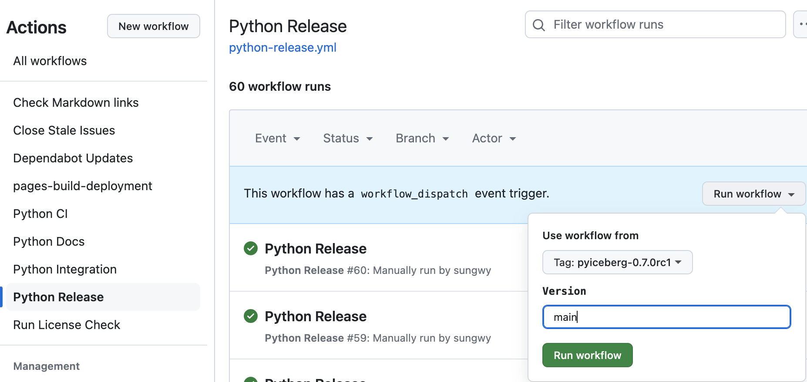
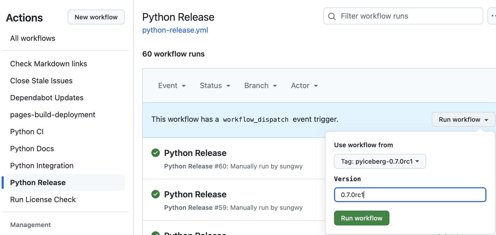
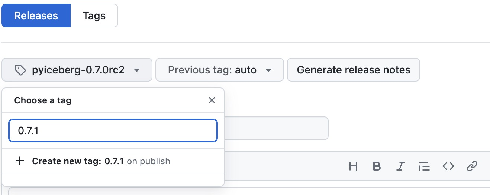

<!--
  - Licensed to the Apache Software Foundation (ASF) under one
  - or more contributor license agreements.  See the NOTICE file
  - distributed with this work for additional information
  - regarding copyright ownership.  The ASF licenses this file
  - to you under the Apache License, Version 2.0 (the
  - "License"); you may not use this file except in compliance
  - with the License.  You may obtain a copy of the License at
  -
  -   http://www.apache.org/licenses/LICENSE-2.0
  -
  - Unless required by applicable law or agreed to in writing,
  - software distributed under the License is distributed on an
  - "AS IS" BASIS, WITHOUT WARRANTIES OR CONDITIONS OF ANY
  - KIND, either express or implied.  See the License for the
  - specific language governing permissions and limitations
  - under the License.
  -->

# How to Release

This guide outlines the process for releasing PyIceberg in accordance with the [Apache Release Process](https://infra.apache.org/release-publishing.html). The steps include:

1. Preparing for a release
2. Publishing a Release Candidate (RC)
3. Community Voting and Validation
4. Publishing the Final Release (if the vote passes)
5. Post-Release Step

## Requirements

* A GPG key must be registered and published in the [Apache Iceberg KEYS file](https://downloads.apache.org/iceberg/KEYS). Follow [the instructions for setting up a GPG key and uploading it to the KEYS file](#set-up-gpg-key-and-upload-to-apache-iceberg-keys-file).
* SVN Access
    * Permission to upload artifacts to the [Apache development distribution](https://dist.apache.org/repos/dist/dev/iceberg/) (requires Apache Commmitter access).
    * Permission to upload artifacts to the [Apache release distribution](https://dist.apache.org/repos/dist/release/iceberg/) (requires Apache PMC access).
* PyPI Access
    * The `twine` package must be installed for uploading releases to PyPi.
    * A PyPI account with publishing permissions for the [pyiceberg project](https://pypi.org/project/pyiceberg/).

## Preparing for a Release

### Remove Deprecated APIs

Before running the release candidate, we want to remove any APIs that were marked for removal under the `@deprecated` tag for this release. See [#1269](https://github.com/apache/iceberg-python/pull/1269).

For example, the API with the following deprecation tag should be removed when preparing for the 0.2.0 release.

```python

@deprecated(
    deprecated_in="0.1.0",
    removed_in="0.2.0",
    help_message="Please use load_something_else() instead",
)
```

We also have the `deprecation_message` function. We need to change the behavior according to what is noted in the message of that deprecation.

```python
deprecation_message(
    deprecated_in="0.1.0",
    removed_in="0.2.0",
    help_message="The old_property is deprecated. Please use the something_else property instead.",
)
```

### Update Library Version

Update the version in `pyproject.toml` and `pyiceberg/__init__.py` to match the release version. See [#1276](https://github.com/apache/iceberg-python/pull/1276).

## Publishing a Release Candidate (RC)

### Release Types

#### Major/Minor Release

* Use the `main` branch for the release.
* Includes new features, enhancements, and any necessary backward-compatible changes.
* Examples: `0.8.0`, `0.9.0`, `1.0.0`.

#### Patch Release

* Use the branch corresponding to the patch version, such as `pyiceberg-0.8.x`.
* Focuses on critical bug fixes or security patches that maintain backward compatibility.
* Examples: `0.8.1`, `0.8.2`.

To create a patch branch from the latest release tag:

```bash
# Fetch all tags
git fetch --tags

# Assuming 0.8.0 is the latest release tag
git checkout -b pyiceberg-0.8.x pyiceberg-0.8.0

# Cherry-pick commits for the upcoming patch release
git cherry-pick <commit>
```

### Create Tag

Ensure you are on the correct branch:

* For a major/minor release, use the `main` branch
* For a patch release, use the branch corresponding to the patch version, i.e. `pyiceberg-0.6.x`.

Create a signed tag:

Replace `VERSION` and `RC` with the appropriate values for the release.

```bash
export RC=rc1
export VERSION=0.7.0${RC}
export VERSION_WITHOUT_RC=${VERSION/rc?/}
export VERSION_BRANCH=${VERSION_WITHOUT_RC//./-}
export GIT_TAG=pyiceberg-${VERSION}

git tag -s ${GIT_TAG} -m "PyIceberg ${VERSION}"
git push git@github.com:apache/iceberg-python.git ${GIT_TAG}
```

### Publish Release Candidate (RC)

#### Upload to Apache Dev SVN

##### Create Artifacts for SVN

Run the [`Python release` Github Action](https://github.com/apache/iceberg-python/actions/workflows/python-release.yml).

* Tag: Use the newly created tag.
* Version: Set the `version` to `main`, as the source cannot be modified.



This action will generate:

* Source distribution (`sdist`)
* Binary distributions (`wheels`) for each architectures. These are created using [`cibuildwheel`](https://github.com/pypa/cibuildwheel)

##### Download Artifacts, Sign, and Generate Checksums

Download the ZIP file containing the artifacts from the GitHub Actions run and unzip it.

Navigate to the release directory. Sign the files and generate checksums:

* `.asc` files: GPG-signed versions of each artifact to ensure authenticity.
* `.sha512` files: SHA-512 checksums for verifying file integrity.

```bash
cd release-main/

for name in $(ls pyiceberg-*.whl pyiceberg-*.tar.gz)
do
    gpg --yes --armor --output "${name}.asc" --detach-sig "${name}"
    shasum -a 512 "${name}" > "${name}.sha512"
done
```

##### Upload Artifacts to Apache Dev SVN

Now, upload the files from the same directory:

```bash
export SVN_TMP_DIR=/tmp/iceberg-${VERSION_BRANCH}/
svn checkout https://dist.apache.org/repos/dist/dev/iceberg $SVN_TMP_DIR

export SVN_TMP_DIR_VERSIONED=${SVN_TMP_DIR}pyiceberg-$VERSION/
mkdir -p $SVN_TMP_DIR_VERSIONED
cp * $SVN_TMP_DIR_VERSIONED
svn add $SVN_TMP_DIR_VERSIONED
svn ci -m "PyIceberg ${VERSION}" ${SVN_TMP_DIR_VERSIONED}
```

Verify the artifact is uploaded to [https://dist.apache.org/repos/dist/dev/iceberg](https://dist.apache.org/repos/dist/dev/iceberg/).

##### Remove Old Artifacts From Apache Dev SVN

Clean up old RC artifacts:

```bash
svn delete https://dist.apache.org/repos/dist/dev/iceberg/pyiceberg-<OLD_RC_VERSION> -m "Remove old RC artifacts"
```

#### Upload to PyPi

##### Create Artifacts for PyPi

Run the [`Python release` Github Action](https://github.com/apache/iceberg-python/actions/workflows/python-release.yml).

* Tag: Use the newly created tag.
* Version: Set the `version` to release candidate, e.g. `0.7.0rc1`.



##### Download Artifacts

Download the zip file from the Github Action run and unzip locally.

##### Upload Artifacts to PyPi

Upload release candidate to PyPi. This **won't** bump the version for everyone that hasn't pinned their version, since it is set to an RC [pre-release and those are ignored](https://packaging.python.org/en/latest/guides/distributing-packages-using-setuptools/#pre-release-versioning).

<!-- prettier-ignore-start -->

!!! note
    `twine` might require an PyPi API token.

<!-- prettier-ignore-end -->

```bash
twine upload release-${VERSION}/*
```

Verify the artifact is uploaded to [PyPi](https://pypi.org/project/pyiceberg/#history).

## Vote

### Generate Vote Email

Final step is to generate the email to the dev mail list:

```bash
export GIT_TAG_REF=$(git show-ref ${GIT_TAG})
export GIT_TAG_HASH=${GIT_TAG_REF:0:40}
export LAST_COMMIT_ID=$(git rev-list ${GIT_TAG} 2> /dev/null | head -n 1)

cat << EOF > release-announcement-email.txt
To: dev@iceberg.apache.org
Subject: [VOTE] Release Apache PyIceberg $VERSION
Hi Everyone,

I propose that we release the following RC as the official PyIceberg $VERSION_WITHOUT_RC release.

A summary of the high level features:

* <Add summary by hand>

The commit ID is $LAST_COMMIT_ID

* This corresponds to the tag: $GIT_TAG ($GIT_TAG_HASH)
* https://github.com/apache/iceberg-python/releases/tag/$GIT_TAG
* https://github.com/apache/iceberg-python/tree/$LAST_COMMIT_ID

The release tarball, signature, and checksums are here:

* https://dist.apache.org/repos/dist/dev/iceberg/pyiceberg-$VERSION/

You can find the KEYS file here:

* https://downloads.apache.org/iceberg/KEYS

Convenience binary artifacts are staged on pypi:

https://pypi.org/project/pyiceberg/$VERSION/

And can be installed using: pip3 install pyiceberg==$VERSION

Instructions for verifying a release can be found here:

* https://py.iceberg.apache.org/verify-release/

Please download, verify, and test.

Please vote in the next 72 hours.
[ ] +1 Release this as PyIceberg $VERSION_WITHOUT_RC
[ ] +0
[ ] -1 Do not release this because...
EOF
```

### Send Vote Email

Verify the content of `release-announcement-email.txt` and send it to `dev@iceberg.apache.org` with the corresponding subject line.

## Vote has failed

If there are concerns with the RC, address the issues and generate another RC.

## Publish the Final Release (Vote has passed)

A minimum of 3 binding +1 votes is required to pass an RC.
Once the vote has been passed, you can close the vote thread by concluding it:

```text
Thanks everyone for voting! The 72 hours have passed, and a minimum of 3 binding votes have been cast:

+1 Foo Bar (non-binding)
...
+1 Fokko Driesprong (binding)

The release candidate has been accepted as PyIceberg <VERSION>. Thanks everyone, when all artifacts are published the announcement will be sent out.

Kind regards,
```

### Upload the accepted RC to Apache Release SVN
<!-- prettier-ignore-start -->

!!! note
    Only a PMC member has the permission to upload an artifact to the SVN release dist.

<!-- prettier-ignore-end -->

```bash
export SVN_DEV_DIR_VERSIONED="https://dist.apache.org/repos/dist/dev/iceberg/pyiceberg-${VERSION}"
export SVN_RELEASE_DIR_VERSIONED="https://dist.apache.org/repos/dist/release/iceberg/pyiceberg-${VERSION_WITHOUT_RC}"

svn mv ${SVN_DEV_DIR_VERSIONED} ${SVN_RELEASE_DIR_VERSIONED} -m "PyIceberg: Add release ${VERSION_WITHOUT_RC}"
```

Verify the artifact is uploaded to [https://dist.apache.org/repos/dist/release/iceberg](https://dist.apache.org/repos/dist/release/iceberg/).

### Remove Old Artifacts From Apache Release SVN

We only want to host the latest release. Clean up old release artifacts:

```bash
svn delete https://dist.apache.org/repos/dist/release/iceberg/pyiceberg-<OLD_RELEASE_VERSION> -m "Remove old release artifacts"
```

### Upload the accepted release to PyPi

The latest version can be pushed to PyPi. Check out the Apache SVN and make sure to publish the right version with `twine`:

<!-- prettier-ignore-start -->

!!! note
    `twine` might require an PyPi API token.

<!-- prettier-ignore-end -->

```bash
svn checkout https://dist.apache.org/repos/dist/release/iceberg /tmp/iceberg-dist-release/
cd /tmp/iceberg-dist-release/pyiceberg-${VERSION_WITHOUT_RC}
twine upload pyiceberg-*.whl pyiceberg-*.tar.gz
```

Verify the artifact is uploaded to [PyPi](https://pypi.org/project/pyiceberg/#history).

## Post Release

### Send out Release Announcement Email

Send out an announcement on the dev mail list:

```text
To: dev@iceberg.apache.org
Subject: [ANNOUNCE] Apache PyIceberg release <VERSION>

I'm pleased to announce the release of Apache PyIceberg <VERSION>!

Apache Iceberg is an open table format for huge analytic datasets. Iceberg
delivers high query performance for tables with tens of petabytes of data,
along with atomic commits, concurrent writes, and SQL-compatible table
evolution.

This Python release can be downloaded from: https://pypi.org/project/pyiceberg/<VERSION>/

Thanks to everyone for contributing!
```

### Release the docs

Run the [`Release Docs` Github Action](https://github.com/apache/iceberg-python/actions/workflows/python-release-docs.yml).

### Update the Github template

Make sure to create a PR to update the [GitHub issues template](https://github.com/apache/iceberg-python/blob/main/.github/ISSUE_TEMPLATE/iceberg_bug_report.yml) with the latest version.

### Update the integration tests

Ensure to update the `PYICEBERG_VERSION` in the [Dockerfile](https://github.com/apache/iceberg-python/blob/main/dev/Dockerfile).

### Create a Github Release Note

Create a [new Release Note](https://github.com/apache/iceberg-python/releases/new) on the iceberg-python Github repository.

Input the tag in **Choose a tag** with the newly approved released version (e.g. `0.7.0`) and set it to **Create new tag** on publish. Pick the target commit version as the commit ID the release was approved on.
For example:


Then, select the previous release version as the **Previous tag** to use the diff between the two versions in generating the release notes.

**Generate release notes**.

**Set as the latest release** and **Publish**.

## Misc

### Set up GPG key and Upload to Apache Iceberg KEYS file

To set up GPG key locally, see the instructions [here](http://www.apache.org/dev/openpgp.html#key-gen-generate-key).

To install gpg on a M1 based Mac, a couple of additional steps are required: <https://gist.github.com/phortuin/cf24b1cca3258720c71ad42977e1ba57>.

Then, published GPG key to the [Apache Iceberg KEYS file](https://downloads.apache.org/iceberg/KEYS):

```bash
svn co https://dist.apache.org/repos/dist/release/iceberg icebergsvn
cd icebergsvn
echo "" >> KEYS # append a newline
gpg --list-sigs <YOUR KEY ID HERE> >> KEYS # append signatures
gpg --armor --export <YOUR KEY ID HERE> >> KEYS # append public key block
svn commit -m "add key for <YOUR NAME HERE>"
```
